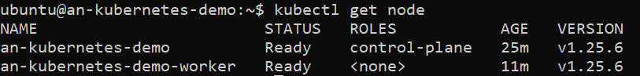

# Instalasi Kubernetes Cluster dengan kubeadm
## Note : Baca setiap langkah dengan seksama, semua perintah dapat langsung disalin dan dijalankan pada server tanpa perlu copy satu per satu tiap perintah
Menggunakan OS __Ubuntu 20.04 LTS__.

Settting Cluster dengan satu Master dan satu Worker Node
Pastikan Master dan Worker Berada dalam satu Network (gunakan NAT Network jika menggunakan VirtualBox)

## Tabel Spesifikasi VM Master dan Worker
|Role|IP|OS|RAM|CPU|
|----|----|----|----|----|
|Master|<ip_VM>|Ubuntu 20.04|2G|2|
|Worker|<ip_VM>|Ubuntu 20.04|1G/2G|1/2|

## Eksekusi command ini pada Master dan Worker
##### Login as `root` user
```
sudo su -
```
### EKSEKUSI SEMUA PERINTAH DENGAN USER ROOT KECUALI DITENTUKAN DENGAN USER NON-ROOT!
##### Disable Firewall
```
ufw disable
```
##### Disable swap
```
swapoff -a; sed -i '/swap/d' /etc/fstab
```
##### Update sysctl settings for Kubernetes networking
```
cat >>/etc/sysctl.d/kubernetes.conf<<EOF
net.bridge.bridge-nf-call-iptables  = 1
net.ipv4.ip_forward                 = 1
net.bridge.bridge-nf-call-ip6tables = 1
EOF
sysctl --system
```

```
modprobe overlay && modprobe br_netfilter
```
### Kubernetes Setup
##### Add Apt repository for Kubernetes Components
```
  curl -s https://packages.cloud.google.com/apt/doc/apt-key.gpg | apt-key add - && add-apt-repository "deb https://apt.kubernetes.io/ kubernetes-xenial main"
```
##### Add Apt Repository Containerd
```
  curl -fsSL https://download.docker.com/linux/ubuntu/gpg | sudo apt-key add - && add-apt-repository "deb [arch=amd64] https://download.docker.com/linux/ubuntu $(lsb_release -cs) stable"
```
##### Install Kubernetes components & Containerd
```
apt install -y kubelet=1.25.6-00 kubeadm=1.25.6-00 kubectl=1.25.6-00 containerd.io
```
##### Misc Setup for Containerd
```
mkdir -p /etc/containerd && containerd config default>/etc/containerd/config.toml
```

```
systemctl restart containerd
```

## Eksekusi command ini pada Master VM
##### Initialize Kubernetes Cluster
### ISI DENGAN IP VM MASTER!
```
kubeadm init --apiserver-advertise-address=<ip_VM> --pod-network-cidr=10.244.0.0/16  --ignore-preflight-errors=all
```

### LOGOUT DARI USER ROOT
```
exit
```
#### Jalankan command berikut agar dapat menjalankan Kubectl saat menggunakan user non-root
```
mkdir -p $HOME/.kube; sudo cp -i /etc/kubernetes/admin.conf $HOME/.kube/config; sudo chown $(id -u):$(id -g) $HOME/.kube/config
```
##### Deploy Flannel Network 
```
kubectl apply -f https://github.com/flannel-io/flannel/releases/latest/download/kube-flannel.yml
```
### Tunggu dan Pastikan Node pada keadaan Ready!

##### Jalankan Command berikut lalu copy output yang dihasilkan!
```
kubeadm token create --print-join-command
```


## Jalankan Pada VM Worker
#### Join sebagai Node Worker
Output __kubeadm token create__ yang telah disalin sebelumnya, paste dan jalankan pada VM Worker
### Pastikan Muncul Seperti Berikut 

## Jalankan Pada VM Master
##### Cek status dari semua Node, tunggu sampai semuanya dalam keadaan Ready
```
kubectl get nodes
```


Written & tested by [RNI](https://github.com/maplezs)
